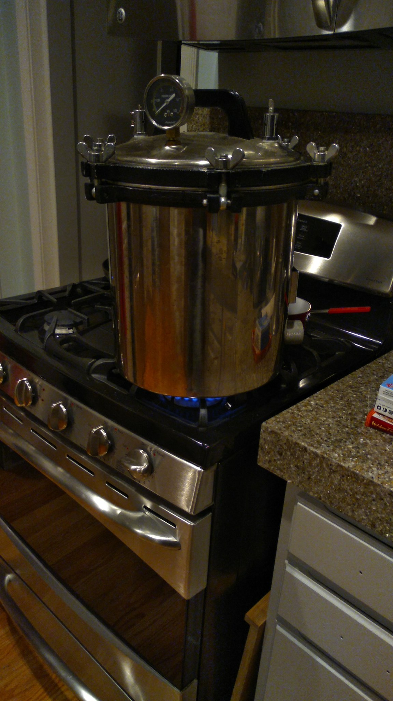

# Experiment 2

## Purpose

Continue debugging growth of yeast in the sacramento setup to ensure that
reproducible colony numbers, colony morphologies, and colony color are
feasible moving forward for the experiment.

### Specific foci of attention
- streamlining processes, checking a different range of dilutions based on
  previous experience

## Methods

### Media making

10 Feb 2021
made 2x 100 mL batches of YP(A)D Media

steps:
- 0.004% adenine hemisulfate ~ 8 mg into a common 200 mL solution in a 500mL
  Fernbach Flask.
- aggressively mixed adenine hemisulfate solution.
- Aliquot 100 mL into its own Fernbach Flask.
- added 5 1g YPD capsules into each of the 2 F.F.s.
- made origami hat with reynold's wrap for both.

other stuff:

- 100 mL YPD-Agar (6g), origami hat
- 3x empty Eppendorf tubes, origami pouch

### Autoclaving

see standard procedure: [experiment-1.md]

